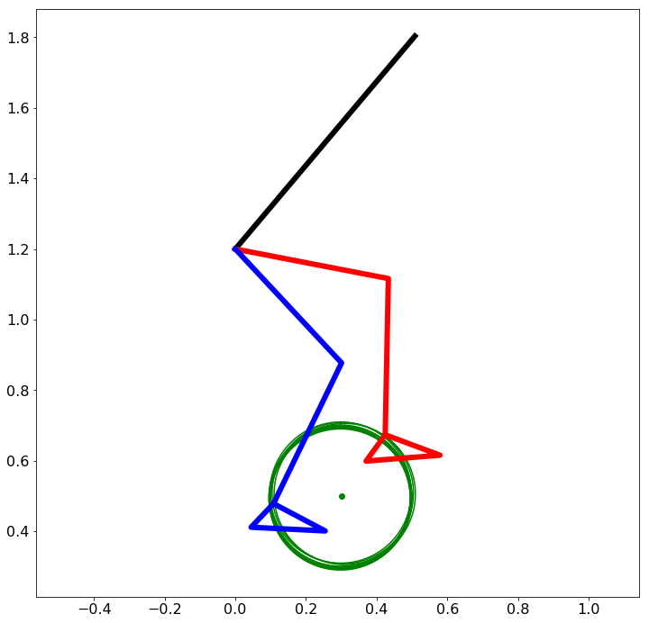

# ExokeletonExerciseMachine
This project is to simulate and test how exoskeleton can sever exercise machine

It will start with cycling exercise machine, since it is a simple exercise and only legs are used.

Primary task are: 

 1. Build a seven-links pendulum model to represent simplified human body.
 2. Build environment-contact model to simulate exercise constraints
 3. Find a high level strategy which let leg move freely unless some contraints are involved.
 4. Design local joint controllers which can very well follow the high level commands
 5. ...
 
 Some assumptions of the exercise exoskeleton:
 1. It has 7 links (trunk, left/right Thigh, left/right shank, left/right foot)
 2. It constains 6 joints (L/R hip, L/R knee, L/R ankle)
 3. The local joint actuator is force-elastic actuactor
 4. ...
 
 This work will be done in Julia Language.
 
